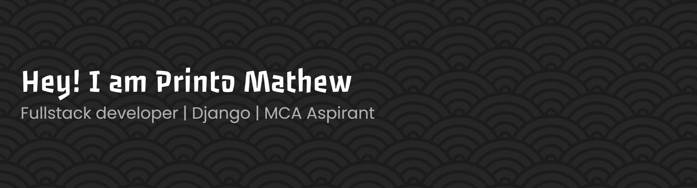

  
  
  
  
  
  

----

<h3 align="center">A Young Passionate Software developer from Kerala,India</h3>

- 🔭 I’m currently pursing MCA **@ MACFAST**

- 🌱 I’m currently learning **Django, Docker**

- 📫 How to reach me **printomathew65@gmail.com**

## Tech Stack

### Languages

 Java

### Mobile & Frontend

### Backend & APIs

### Databases

### DevOps & Tools

### Data & Analysis

### Productivity - MS Office Tools & Design Tools

&nbsp;

